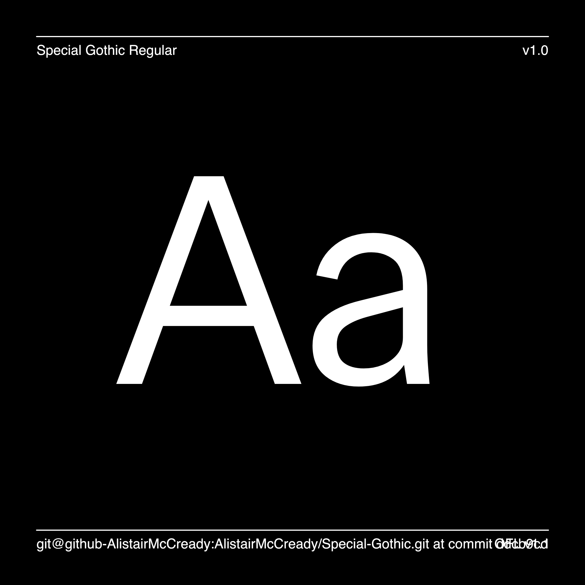

# Special Gothic

Special Gothic is a multi-width sans serif typeface built as a contemporary reimagining of the raw tenacity offered up by early 20th century Gothic type styles.

Special Gothic was created for and in collaboration with Special Group to celebrate a monumental 15 years as an internationally renowned design and advertising studio.

### [Download the latest fonts](https://github.com/AlistairMcCready/Special-Gothic/releases)

## About

[Alistair McCready](https://monolith.nz/) is a New Zealand born designer, currently working in Tāmaki Makaurau / Auckland. He believes strongly that if we want to see the future, we need to understand our past. Since 2015, Alistair’s studio; Monolith — has tasked itself with producing work composed out of attention to aesthetic and technological detail. Monolith is founded on the belief that the best ideas are only strengthened by the ability to execute them with care and craft, working alongside a international design studios, type foundries and independent organisations. 

Production and GitHub assistance by [Wei Huang](https://github.com/weiweihuanghuang).

## Building

Fonts are built automatically by GitHub Actions - take a look in the "Actions" tab for the latest build.

If you want to build fonts manually on your own computer:

* `make build` will produce font files.
* `make test` will run [FontBakery](https://github.com/googlefonts/fontbakery)'s quality assurance tests.
* `make proof` will generate HTML proof files.

The proof files and QA tests are also available automatically via GitHub Actions - look at `https://github.com/AlistairMcCready/Special-Gothic`.

## Changelog

**31 October 2022. Version 1.00**

- INITIAL UPLOAD

## License

This Font Software is licensed under the SIL Open Font License, Version 1.1.
This license is available with a FAQ at
https://scripts.sil.org/OFL

## Repository Layout

This font repository structure is inspired by [Unified Font Repository v0.3](https://github.com/unified-font-repository/Unified-Font-Repository), modified for the Google Fonts workflow.

[![][Fontbakery]](https://AlistairMcCready.github.io/Special-Gothic/fontbakery/fontbakery-report.html)
[![][Universal]](https://AlistairMcCready.github.io/Special-Gothic/fontbakery/fontbakery-report.html)
[![][GF Profile]](https://AlistairMcCready.github.io/Special-Gothic/fontbakery/fontbakery-report.html)
[![][Outline Correctness]](https://AlistairMcCready.github.io/Special-Gothic/fontbakery/fontbakery-report.html)
[![][Shaping]](https://AlistairMcCready.github.io/Special-Gothic/fontbakery/fontbakery-report.html)

[Fontbakery]: https://img.shields.io/endpoint?url=https%3A%2F%2Fraw.githubusercontent.com%2FAlistairMcCready%2FSpecial-Gothic%2Fgh-pages%2Fbadges%2Foverall.json
[GF Profile]: https://img.shields.io/endpoint?url=https%3A%2F%2Fraw.githubusercontent.com%2FAlistairMcCready%2FSpecial-Gothic%2Fgh-pages%2Fbadges%2FGoogleFonts.json
[Outline Correctness]: https://img.shields.io/endpoint?url=https%3A%2F%2Fraw.githubusercontent.com%2FAlistairMcCready%2FSpecial-Gothic%2Fgh-pages%2Fbadges%2FOutlineCorrectnessChecks.json
[Shaping]: https://img.shields.io/endpoint?url=https%3A%2F%2Fraw.githubusercontent.com%2FAlistairMcCready%2FSpecial-Gothic%2Fgh-pages%2Fbadges%2FShapingChecks.json
[Universal]: https://img.shields.io/endpoint?url=https%3A%2F%2Fraw.githubusercontent.com%2FAlistairMcCready%2FSpecial-Gothic%2Fgh-pages%2Fbadges%2FUniversal.json